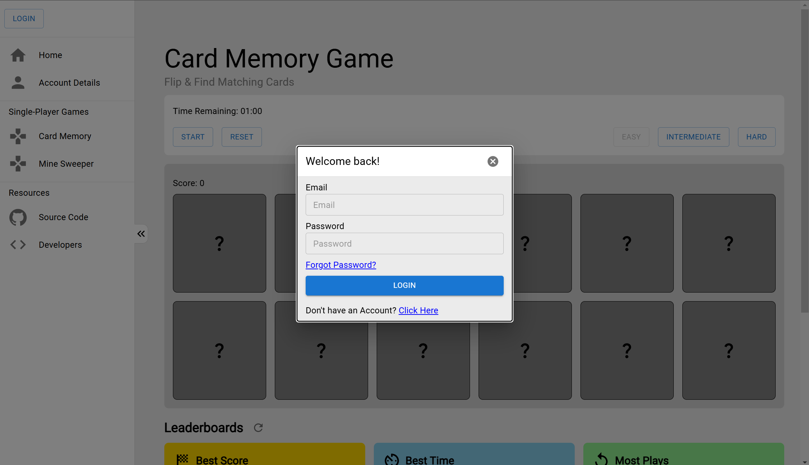
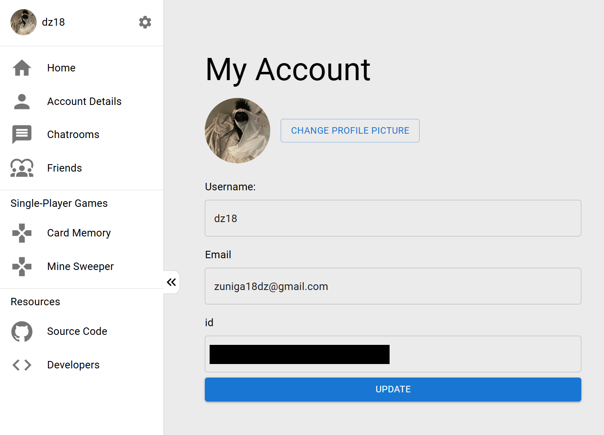
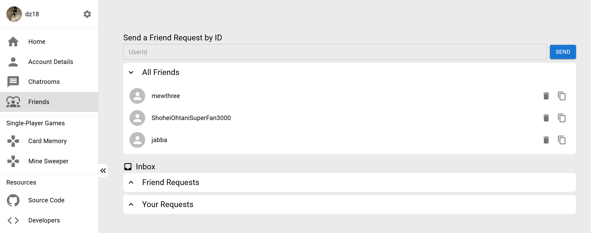
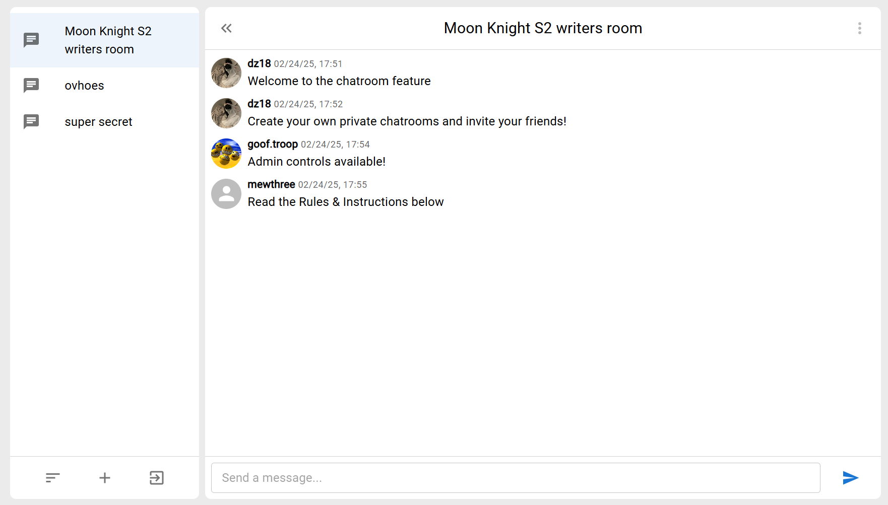
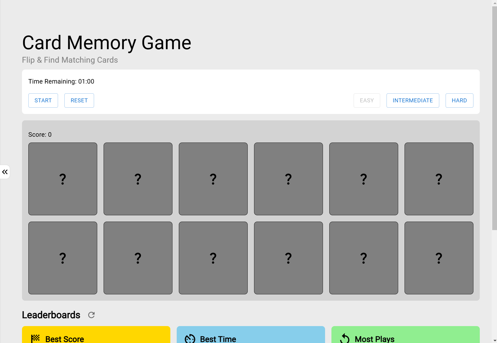

# Arcard Vault

### About the Project

Welcome to Arcade Vault, a react website that hosts mini-games with interactive social features.  

### Built With

For this project, I used the following major frameworks/libraries.
- 
- 
- 


### Current Project Roadmap

* [X] Real-time Database
* [X] Friend Requests
* [X] Private Chatrooms
* [X] User Profiles
* [X] Card Memory Game
* [X] Card Memory Leaderboards
* [X] Minesweeper Game
* [ ] Minesweeper Leaderboards
* [ ] Simon-Says Game
* [ ] Simon-Says Leaderboards
* [ ] Public Chatrooms

## Getting Started

The website is published through the Netlify publisher. Click the link here (TO BE PUBLISHED SOON)

Otherwise, follow these steps to download Arcade Vault locally on your system.

1. ✅ Clone the repository 
    ```bash
    git clone https://github.com/dz18/Arcade-Vault
    ```

2. ✅ Install NPM packages 

    ```bash
    npm install
    ```

3. ✅ Enter API keys in ```.env``` (use ```.env.template``` as a guide)
    ```javascript
    const API_KEY = 'ENTER YOUR API';
    ```

4. ✅ Change git remote url to avoid accidental pushes to base project
    ```bash
    git remote set-url origin github_username/repo_name
    git remote -v # confirm the changes
    ```

## Usage

### Login/Sign-Up
 

### Your Account

***NOTE**: Your Id should only be shared among friends*

### Your Friends


### Private Chatrooms


### Card Memory Game


## Contacts
- github: @dz18
- email: dylan18zuniga@gmail.com